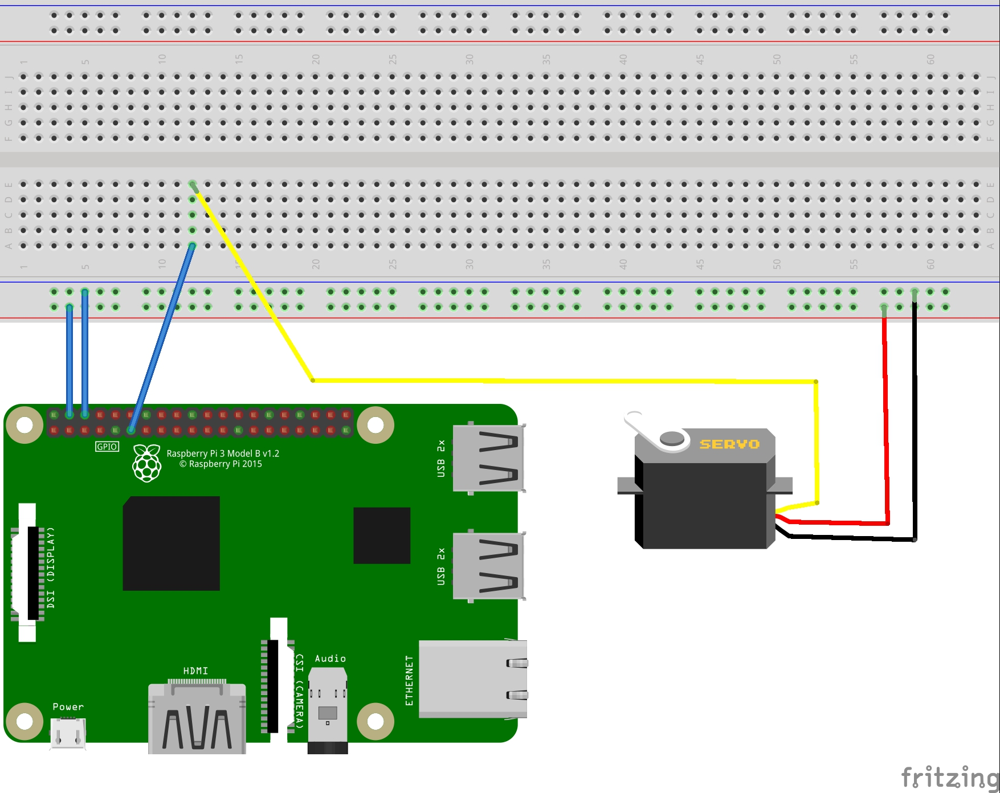

# Control remoto desde web de un servo con raspberry pi.

El objetivo de esta práctica es diseñar un control de un servo vía web, a través de internet por medio de una raspberry pi (en nuestro caso versión 3+). Se trata de un concepto similar al que ser realiza en domótica o IoT. 

## Materiales
* Raspberry pi.
* Servo SG90.
* Protoboard.
* Cables de conexionado.

Para el diseño se ha ralizado un entorno web sencillo, marcado por 11 botones que van desde el 0% al 100% de las posibilidades del servo. 
Al tratarse del modelo de servo SG90 [(Ficha Técnica)](../control-de-servo-desde-web-con-raspberry-pi/sg90_datasheet.pdf). El rango de giro va desde -90º hasta +90º (Un rango total de 180º). Por lo que cada escalón viene a correlacionarse con 18º.


## Esquema eléctrico
El servo SG90 tiene tres conexiones
* GND 
* 5V
* PWM (donde por modulación del ancho de pulso se indica el ángulo a disponer en  el servo)




## CÓDIGO PYTHON
```python
import RPi.GPIO as GPIO                 # Importa libreria de manejo GPIO
import time                             # Importa time para el manejo del tiempo en segundos.
from flask import *                     # Importa flask para el manejo de la web
app = Flask(__name__)

servoPIN = 17                           # Conectamos servo cable PWM a Pin GPIO 17
GPIO.setmode(GPIO.BCM)                  
GPIO.setwarnings(False)                 # Evitar mensajes de alarma.
GPIO.setup(servoPIN, GPIO.OUT)          # Establecemos el pin del servo como salida

p = GPIO.PWM(servoPIN, 50)              # GPIO 17 PWM a 50Hz
p.start(2.5)                            # Initialization en ángulo 0
time.sleep(2)

@app.route('/')                        
def home():
   templateData = {                     # Manda al template el valor de águlo igual a 0
      'angulo' : 0,
   }
   return render_template('servo.html', **templateData)     # Renderiza el template html con ese valor

@app.route('/<angle>')
def servo(angle):
   p.ChangeDutyCycle(2.5+int(angle)/10)                     # Da el nuevo valor para el servo en PWM
   templateData = {                                         # Mánda al template el nuevo valor del ángulo
      'angulo' : int(angle),
   }
   return render_template('servo.html', **templateData)     # Renderíza el template html con el nuevo valor

if __name__ == '__main__':
   app.run(host='0.0.0.0', port=8000, debug=True)
```
## CÓDIGO HTML
```HTML
<html>
<head>
   <style>
      .btn { 
         margin: 10px;
         padding: 10px 20px;
         text-align: center;
         border: 1px solid #000;
         background: #ccc;
         text-decoration: none;
         font-size: 30px;
         line-height: 3;
         color: #000;
      }
      .btn.angulo {
         background: #ff0;
      }
   </style>
</head>
<body>
   
      <a class="btn angulo" href="/0">0</a>
   
      <a class="btn" href="/0">0</a>
   

   
      <a class="btn angulo" href="/10">10</a>
   
      <a class="btn" href="/10">10</a>
   
   
   
      <a class="btn angulo" href="/20">20</a>
   
      <a class="btn" href="/20">20</a>
   

   
      <a class="btn angulo" href="/30">30</a>
   
      <a class="btn" href="/30">30</a>
   
   
   
      <a class="btn angulo" href="/40">40</a>
   
      <a class="btn" href="/40">40</a>
   
   
   
      <a class="btn angulo" href="/50">50</a>
   
      <a class="btn" href="/50">50</a>
   
   
   
      <a class="btn angulo" href="/60">60</a>
   
      <a class="btn" href="/60">60</a>
   
   
   
      <a class="btn angulo" href="/70">70</a>
   
      <a class="btn" href="/70">70</a>
   
   
   
      <a class="btn angulo" href="/80">80</a>
   
      <a class="btn" href="/80">80</a>
   

   
      <a class="btn angulo" href="/90">90</a>
   
      <a class="btn" href="/90">90</a>
   
   
   
      <a class="btn angulo" href="/100">100</a>
   
      <a class="btn" href="/100">100</a>
     
   
</body>
</html>
```
