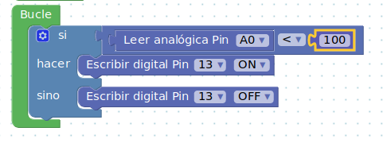

# Encendido nocturno

El objetivo de esta práctica es encender un LED utilizando un sensor de luz LDR, es decir, queremos que se encienda LED cuando cae la noche y oscurece. En caso contrario el LED permanecerá apagado. Para ello utilizaremos un sensor LDR.


## Materiales

- 1 Arduino UNO
- 1 Protoboard
- 4 Latiguillos
- 1 LED
- 1 Sensor LDR
- 1 Resistencia de 220Ω (rojo-rojo-marrón)
- 1 Resistencia de 10KΩ (marrón-negro-naranja)

## Esquema eléctrico

| Sensor LDR                        |       |
| --------------------------------- | ----- |
| Polarizado                        | No    |
| Resistencia mínima (con luz)      | 100Ω  |
| Resistencia máxima (sin luz)      | 1MΩ   |

| Características LED              |        |
| -------------------------------- | ------ |
| Polarizado                       | Sí     |
| Intensidad de Corriente          | 20mA   |
| Tensión Led (verde, ámbar, rojo) | 2.1V   |
| Tensión Led blanco               | 3.3V   |

**Cálculo de la resistencia para el LED**

```
V = 5V - 2.1V = 2.9V
I = 20mA

V = I x R ; R = V / I

R = 2.9V / 0.02A = 145Ω -> 220Ω (por aproximación)
```

Por un lado se conecta el LED al pin digital 13 de la placa de arduino (utilizando su debida resistencia). Por otro lado, se conecta el sensor LDR al pin analógico 0 de la placa de arduino (utilizando la resistencia en modo Pull-Down).


## Programación en mBlock

Al ejecutar el código se calcula el valor del sensor analógico conectado al pin 0 de la placa de arduino, y en caso de ser superior al valor 150 se activará la salida digital 13 encendiendo el LED. En caso contrario el LED permanecerá apagado.


## Programación en ArduinoBlocks

Similar a la programación en mBlocks aunque en este caso se tomó como umbral el valor 100 en A0.



## Programación en Arduino

En primer lugar, se configura el pin digital 13 en modo salida (OUTPUT). Esta configuración se establece en la función setup(), ya que solamente se ejecuta una vez.

Por otro lado, en la función loop() se calcula el valor del sensor analógico conectado al pin 0 de la placa de arduino, y en caso de ser superior al valor 150 se activará la salida digital 13 encendiendo el LED. En caso contrario el LED permanecerá apagado.

```arduino
/**
 * Encendido nocturno
 */

void setup() {
    pinMode(13, OUTPUT);
}

void loop() {
    if (analogRead(0) > 150) {
        digitalWrite(13, HIGH);
    }
    else {
        digitalWrite(13, LOW);
    }
}
```
