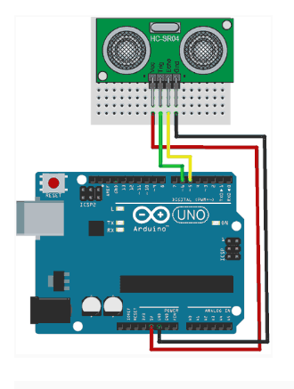

# ARDUINO Y RASPBERRY TOMA DE DATOS EN FICHERO CSV CON UN SENSOR DE ULTRASONIDOS

Este tutorial lo hemos realizado con mucho cariño entre Paqui Vicente y Cristina Momblona. Espero que os guste.

Vamos a conectar Raspberry Pi con Arduino para controlar un sensor de ultrasonidos, que se comuniquen entre ellos a través del puerto serie y almacenar los datos en un fichero CSV.

## Materiales

- Raspberry Pi con Raspbian
- Arduino UNO
- Sensor de ultrasonidos
- Cables para realizar las conexiones

Antes de comenzar debemos instalar el IDE de Arduino  y  Python Serial.
en nuestra Raspberry Pi.

## ESQUEMA MONTAJE:




## CÓDIGO ARDUINO

```arduino
// const int TrigPin = 5; 
const int EchoPin = 6; 
int cm; 
void setup(){ 
  Serial.begin(9600); 
  pinMode(TrigPin, OUTPUT); 
  pinMode(EchoPin, INPUT); 
} 
void loop(){ 
  digitalWrite(TrigPin, LOW); //LOW y HIGH para mandar un pulso breve al pin Trig
  delayMicroseconds(2); 
  digitalWrite(TrigPin, HIGH); 
  delayMicroseconds(10); 
  digitalWrite(TrigPin, LOW); 
 
  cm = pulseIn(EchoPin, HIGH) / 58.0; //Convertimos el tiempo de eco en cm
 
  String cadena = String(cm);
  Serial.println(cadena);
 
  delay(1000); 
}


