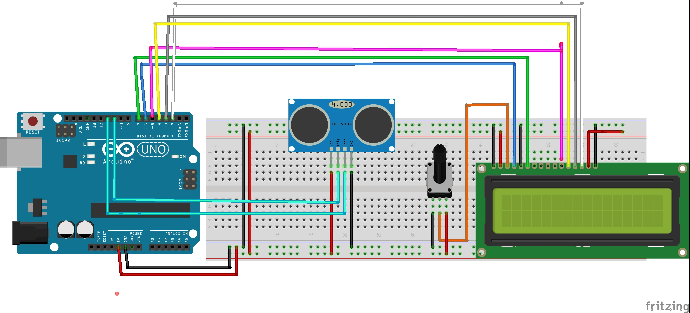

# Medidor de distancias con una pantalla LCD

En esta práctica se medirá una distancia con el sensor de ultrasonidos HC-SR04 mostrando el resultado en una pantalla LCD. 


## Materiales

- Arduino UNO
- Placa de ensayo
- Sensor de ultrasonidos
- Potenciómetro de 10kΩ
- Pantalla LCD estándar
- Cables

## Esquema eléctrico

Correspondencia pines LCD - Arduino

| LCD             |  Arduino     |
| -------------------------------- | ------ |
|     VSS                   | GND|
| VDD          | 5V   |
| VO | Pin central del  potenciómetro (no Arduino) |
| RS              | Pin 6   |
| RW             | GND   |
| E | Pin 7   |
| D4              | Pin 5  |
| D5              | Pin 4  |
| D6              | Pin 3  |
| D7              | Pin 2  |
| A              | 5V  |
| K              | GND  |




## Programación en Bloques

(Programa utilizado e imagen) .


## Programación en Arduino

```arduino

```

## Fuentes

- https://www.youtube.com/watch?v=I5-gq7J7lM4
- https://create.arduino.cc/projecthub/Techinc1510/hc-sro4-distance-measurer-with-lcd-1602-f94579


