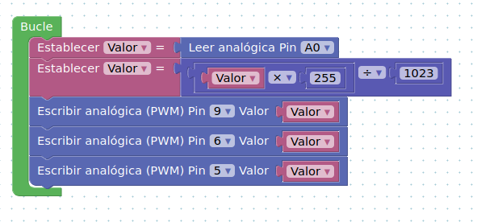

# Regulador de luz

El objetivo de esta práctica es regular la intensidad de 3 LEDs utilizando un potenciómetro, es decir, podemos variar la cantidad de luz que emiten los LEDs girando el potenciómetro desde su posición de resistencia mínima a resistencia máxima.


## Materiales

- 1 Arduino UNO
- 1 Protoboard
- 7 Latiguillos
- 3 LEDs
- 3 Resistencia de 100Ω (marrón-negro-marrón)
- 1 Potenciómetro

## Esquema eléctrico

| Potenciómetro      |       |
| ------------------ | ----- |
| Polarizado         | Sí    |
| Resistencia mínima | 0Ω    |
| Resistencia máxima | 10KΩ  |
| Precisión          | 5%    |

| Características LED              |        |
| -------------------------------- | ------ |
| Polarizado                       | Sí     |
| Intensidad de Corriente          | 20mA   |
| Tensión Led (verde, ámbar, rojo) | 2.1V   |
| Tensión Led blanco               | 3.3V   |

**Cálculo de la resistencia para el LED**

```
V = 5V - 2.1V = 2.9V
I = 20mA

V = I x R ; R = V / I

R = 2.9V / 0.02A = 145Ω -> 220Ω (por aproximación)
```

Por un lado se conectan los LEDs a los pines 9, 6 y 5 de la placa de arduino (utilizando su debida resistencia). Por otro lado, se conecta el potenciómetro al pin analógico 0 de la placa de arduino.


## Programación en ArduinoBlock



## Programación en mBlock

Al ejecutar el código se calcula el valor analógico del potenciómetro y se almacena en una variable. A continuación se interpola el valor obtenido en la entrada analógica a través del potenciómetro (o-1023) con el valor de salida analógica (0-255). Todos los LEDs se encenderán con la misma intensidad fijada en la variable.


## Programación en Arduino

En primer lugar, se configuran los pines analógicos 9, 6 y 5 en modo salida (OUTPUT). Esta configuración se establece en la función setup(), ya que solamente se ejecuta una vez.

Al ejecutar el código se calcula el valor analógico del potenciómetro y se almacena en una variable. A continuación se interpola utilizando la función map() el valor obtenido en la entrada analógica a través del potenciómetro (o-1023) con el valor de salida analógica (0-255). Todos los LEDs se encenderán con la misma intensidad fijada en la variable.

```arduino
/**
 * Regulador de luz
 */

void setup() {
    pinMode(9, OUTPUT);
    pinMode(6, OUTPUT);
    pinMode(5, OUTPUT);
}

void loop() {
    int valor = analogRead(0);
    valor = map(valor, 0, 1023, 0, 255);
    
    analogWrite(9, valor);
    analogWrite(6, valor);
    analogWrite(5, valor);
    delay(15);
}
```
